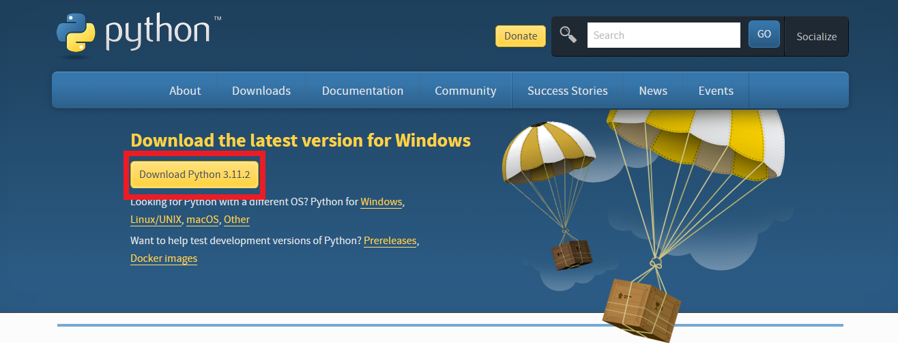
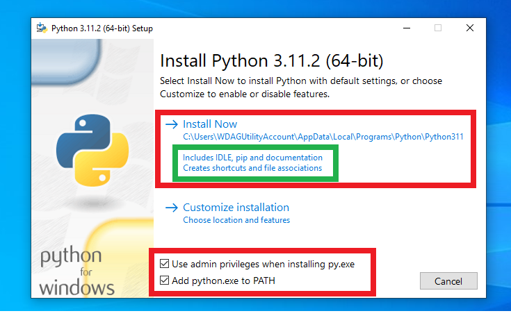
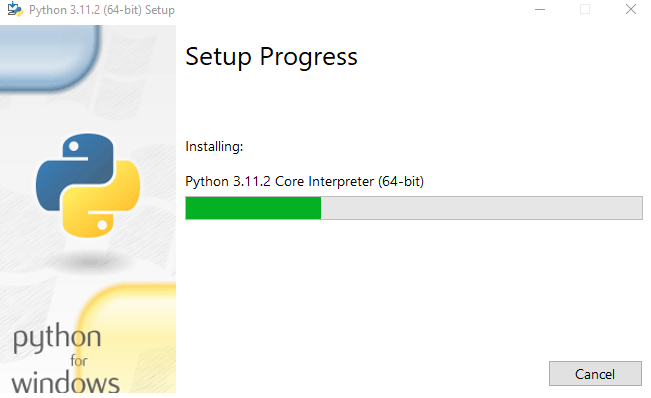
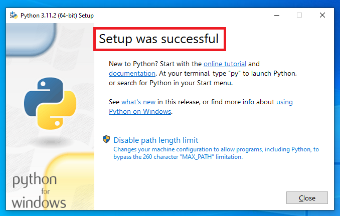

# Python Environment Setup
## Please follow the instructions step by step

# **Installing Python**

- Step 1. Go to https://www.python.org/downloads/ and download the available version of python.

