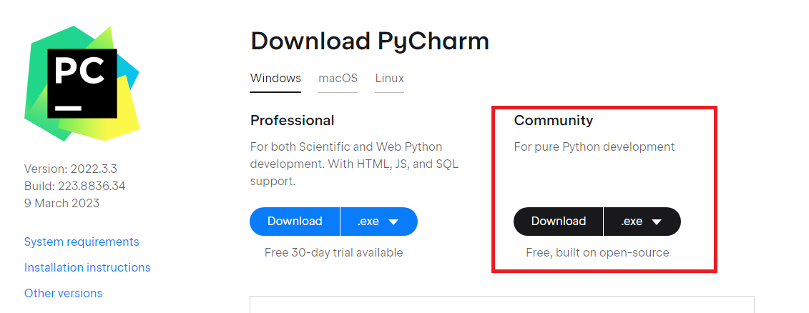
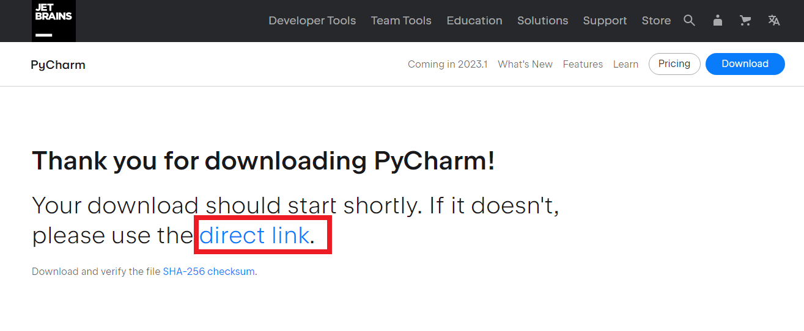
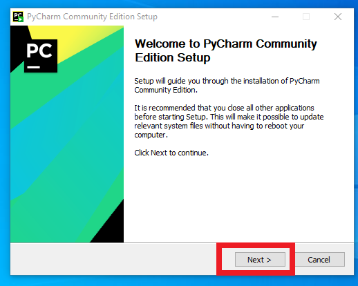
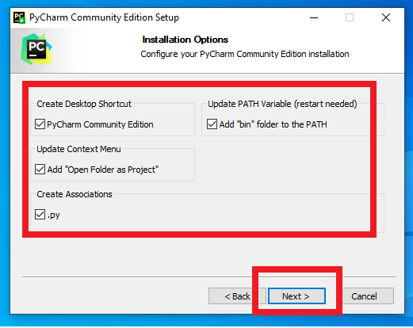
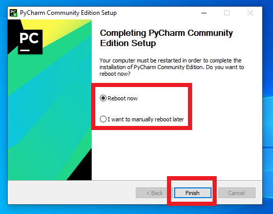

# Python Environment Setup
## Please follow the instructions step by step

# **Installing Python**

## Step 1. Go to https://www.python.org/downloads/ and download the available version of python.

## Step 2. Selct the install python option.

## Step 3. Wait till the installation is complete.

## Step 4. Installation Complete.

 
# **Installing PyCharm**

## Step 1. Go to https://www.jetbrains.com/pycharm/download and download PyCharm.

## Step 2. If the link doesn't work try the direct link.

## Step 3. Select the Next Button once applcation is downloaded.

## Step 4. Select the all the checkboxes once we reach the next page.

## Step 5. Installation Complete, choose either Reboot Now or I want to reboot later and select Finish

# Installation and Setup Complete to start working.
